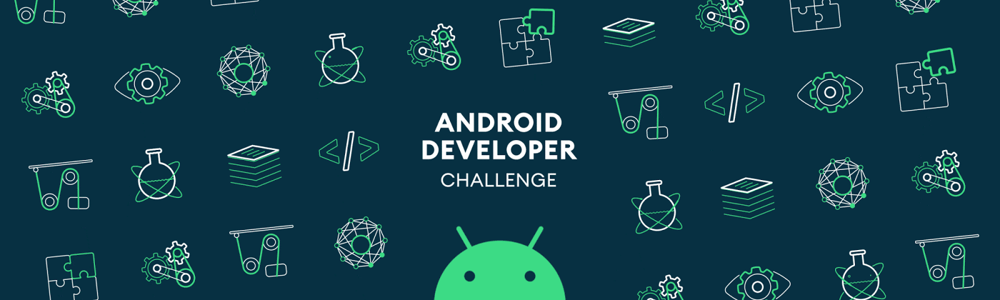

# 👋 Hi, I'm Muntazir Halim

### 💻 Developer from Iraq 🇮🇶

  

* 🚀 Full-Stack & Mobile Developer
* 📱 Flutter & Dart Developer
* ⚙️ Backend Developer with Go & Gin
* 🗄️ MongoDB & Database Development
* 💳 Payment & FinTech Integrations
* 🔥 Firebase & Cloud Services
* 🎨 UI/UX Design with Figma
* 📫 Email: **[muntazirhalim@gmail.com](mailto:muntazirhalim@gmail.com)**
* 📞 Phone: **07844544010**

---

## 🌐 Connect with me

  
  
  

---

## 🛠️ Languages & Tools

  
  
  
  
  
  
  
  
  
  
  

---

## 💼 What I Do

* 📱 Build modern cross-platform mobile applications
* 🌐 Develop scalable REST APIs
* 💳 Integrate payment gateways and financial services
* 🔐 Implement authentication and security systems
* ☁️ Deploy applications and backend services
* 🗄️ Design and manage databases
* 🎨 Create clean and modern UI/UX

---

  <b>🇮🇶 Building and creating from Iraq</b>

